# DevBlog

[Live App](https://devblog-zijp.onrender.com/)

## Introduction
Fullstack blogging platform featuring a simple, yet intuitive UI, inspired by [Medium](https://medium.com/). Register an account and start writing today!

## Tech
React, JavaScript, Node.js, Express.js, Redux, MongoDB, HTML/ CSS

## Features
<ul>
  <li>Publish your own blogs after registering an account</li>
  <li>Follow your favourite authors</li>
  <li>Easy to use with intutive UI</li>
  <li>Responsive UI for desktop & mobile</li> 
  <li>Email verification for bot/spam prevention</li>  
  <li>Route security with rate limiting</li>  
  <li>Role-based authorization</li>  
</ul>

## Screenshots
### Full view
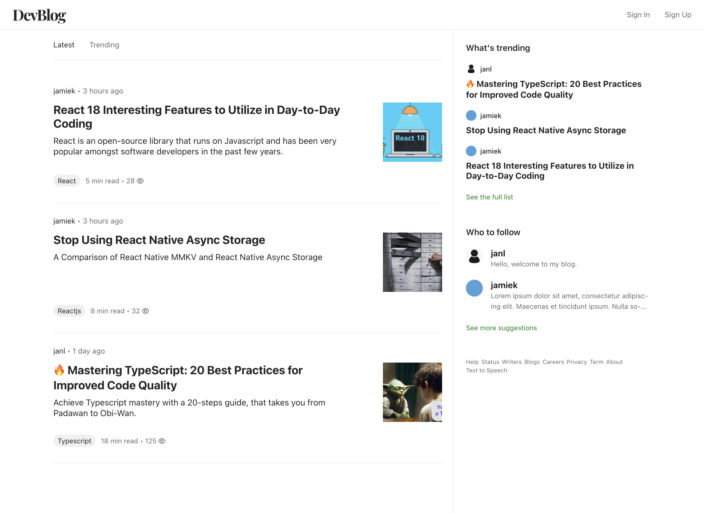
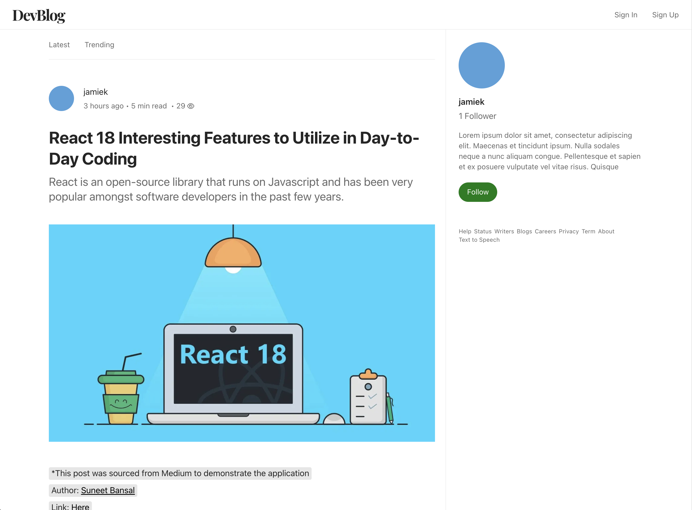
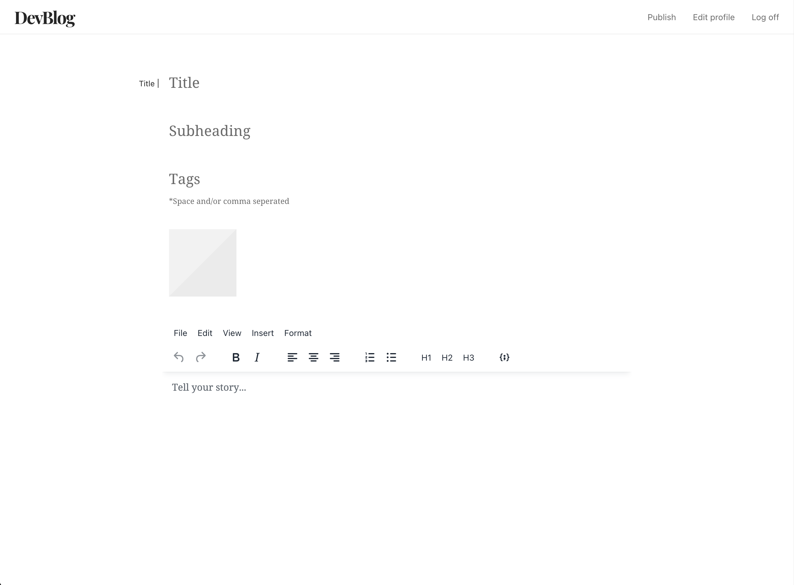
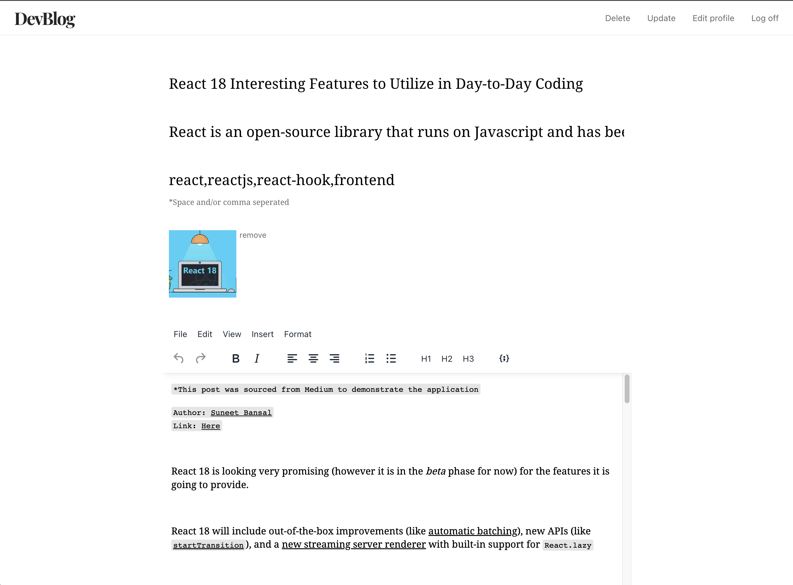
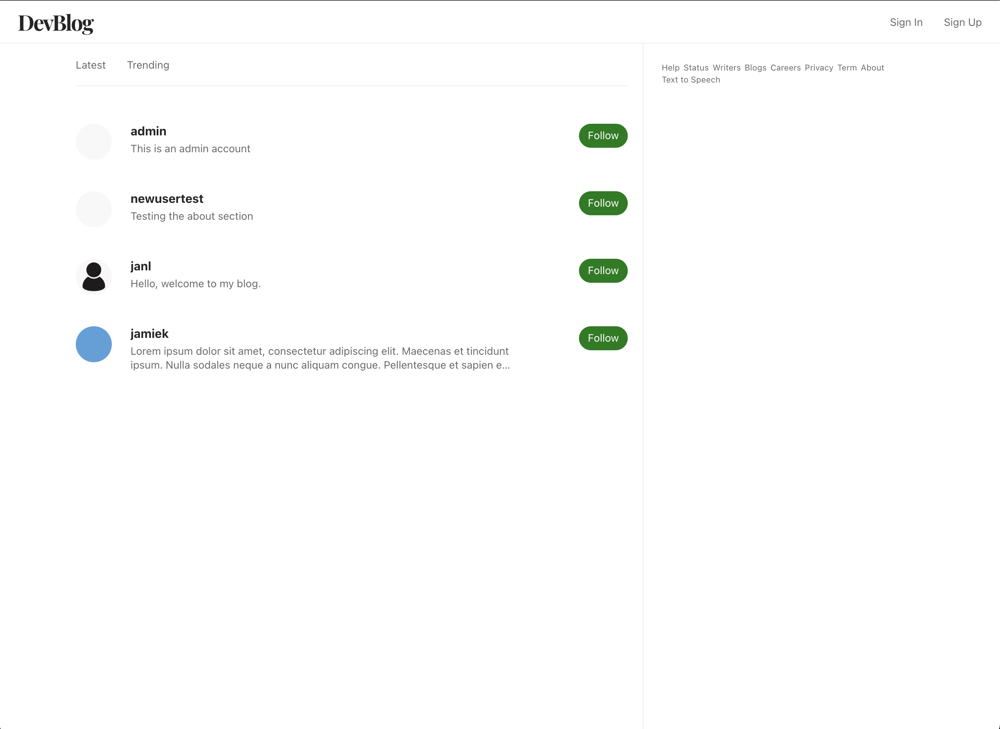
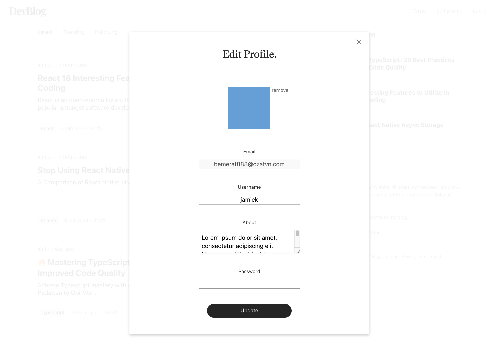
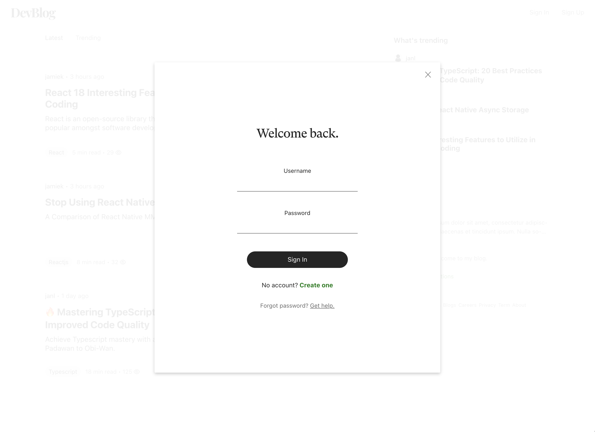
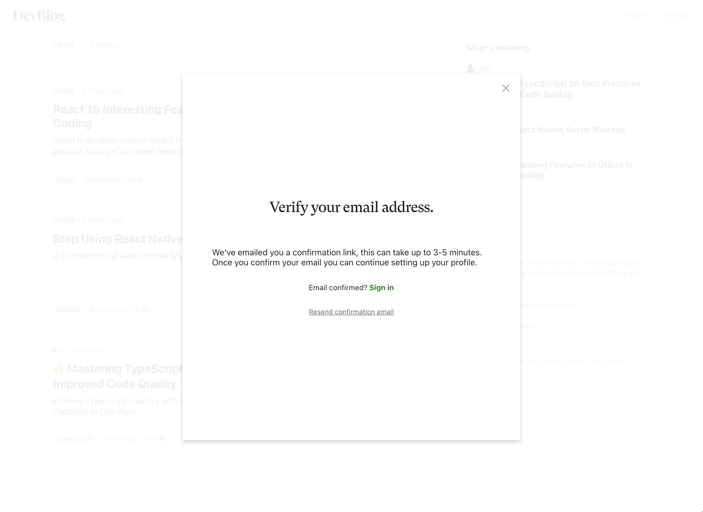

### Mobile
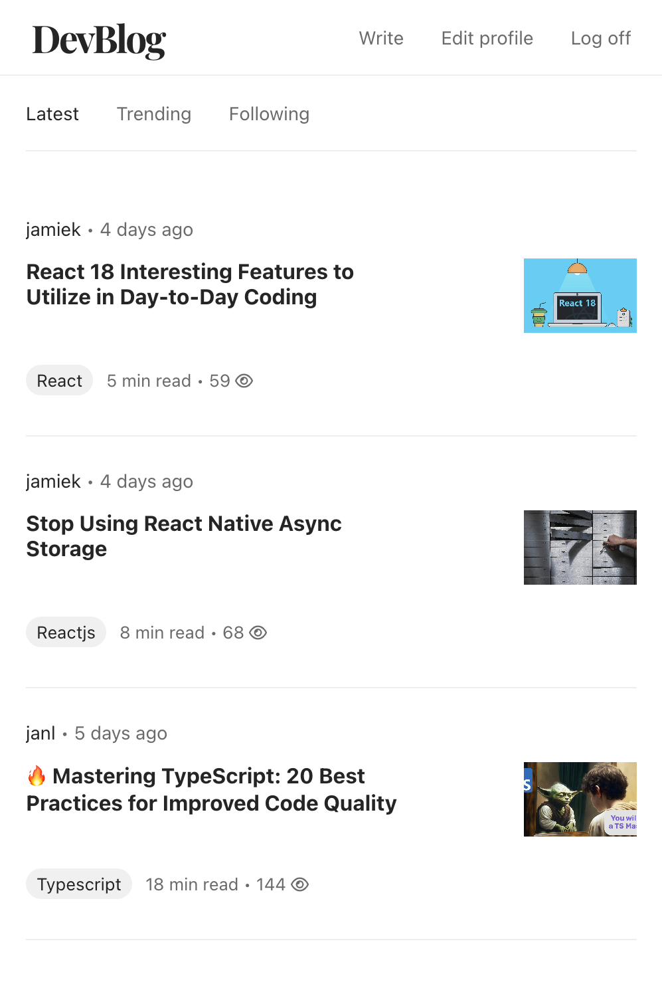
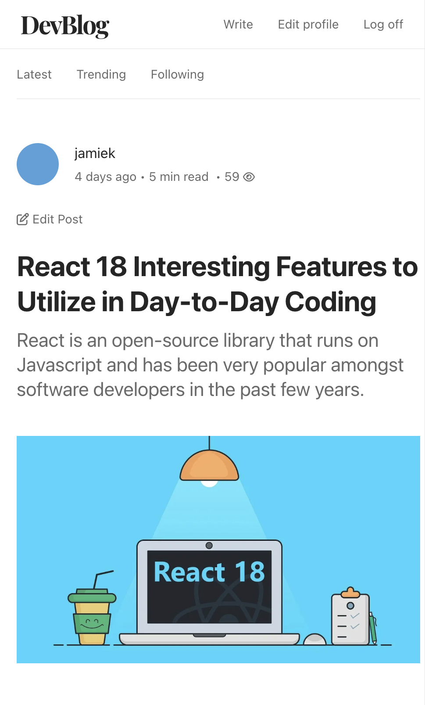
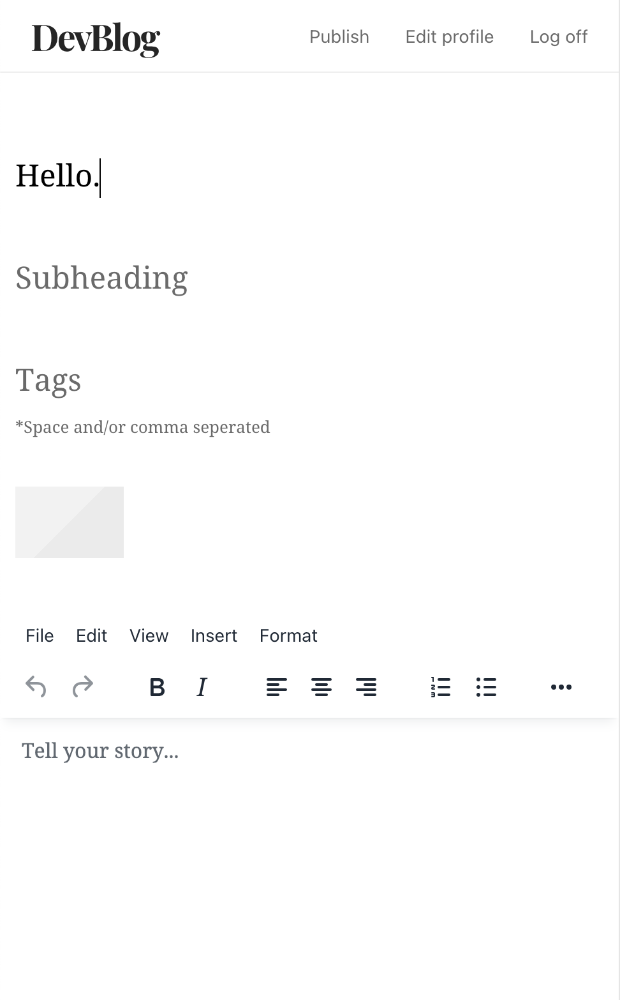
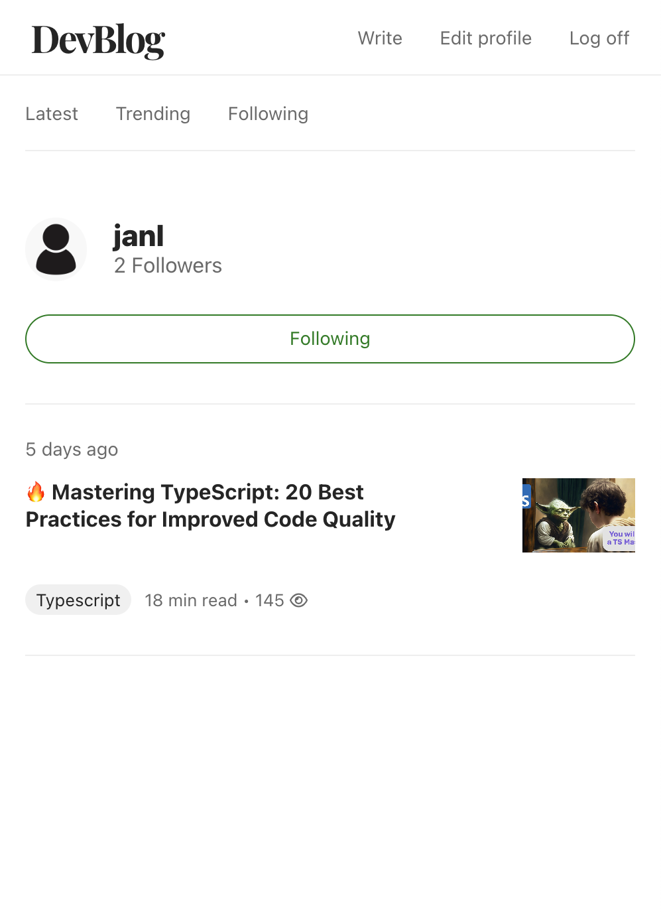
